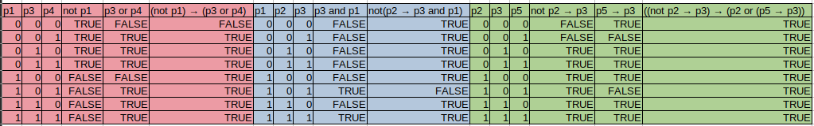

# Ejercicio 2

Primero busco las valuaciones v tales que $v \vDash \alpha_i$ para cada i = 1, 2, 3.

Ahora veo la intersección de las filas que dan true para ver las valuaciones tales que $v \vDash \alpha_i$ para todo i.

Primero: (p1,p3,p4) != (0,0,0)

Segundo: (p1,p2,p3) != (1,0,1)

Si ambas se cumplen entonces las tres formulas son verdaderas.

??